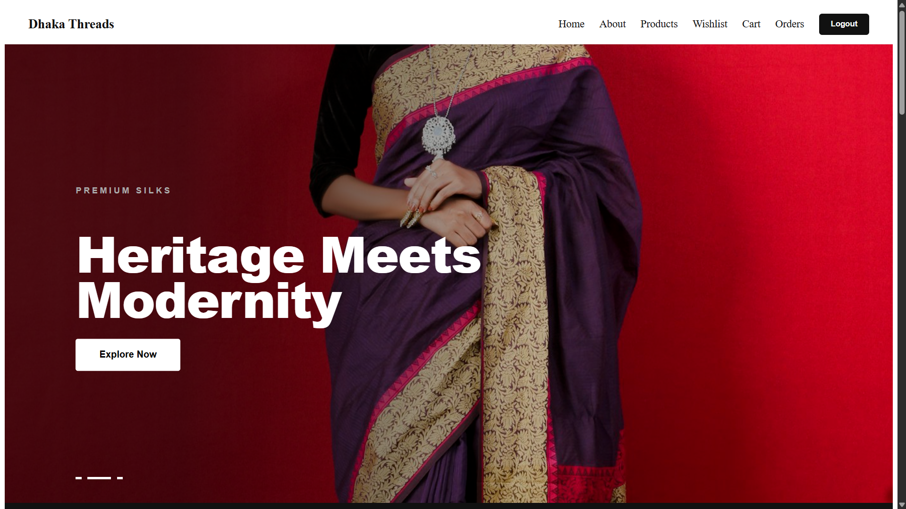
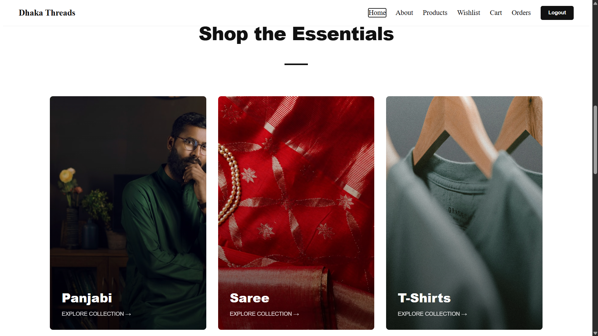

# 🛍️ Dhaka Threads — Full-Stack E-Commerce Platform

A modern, production-grade **fashion e-commerce platform** built with React.js and Django REST Framework. Features real-time product filtering, persistent cart/wishlist, JWT-secured authentication, and an editorial-style mobile-first UI.

🌐 **Live Demo:** [dhaka-threads-client.vercel.app](https://dhaka-threads-client.vercel.app/)
&nbsp;|&nbsp;
💻 **Frontend Repo:** [github.com/jjannat04/dhaka-threads-client](https://github.com/jjannat04/dhaka-threads-client)
&nbsp;|&nbsp;
🔧 **Backend Repo:** [github.com/jjannat04/dhaka-threads-backend](https://github.com/jjannat04/dhaka-threads-backend)

---

## 📸 Preview

> _Add a screenshot of your storefront or product page here._
> 
> 

---

## 🧩 Tech Stack

| Layer | Technology |
|-------|-----------|
| Frontend | React.js, Context API, CSS3 |
| Backend | Django, Django REST Framework (DRF) |
| Database | PostgreSQL / SQLite |
| Auth | JWT (JSON Web Token) |
| Deployment | Vercel (Frontend) |

---

## ✨ Features

- 🔍 **Real-Time Product Filtering** — Dynamic product engine with async API fetching; filters by category, price, and more without page reloads
- 🛒 **Persistent Cart & Wishlist** — Global state management via React Context API; cart and wishlist survive across page navigation
- 🔐 **JWT Authentication** — Secure login/register flow with token-based auth protecting all user-specific actions
- ⭐ **Review & Rating System** — Verified users can leave product reviews and star ratings
- 📱 **Mobile-First UI** — Editorial-style design with glassmorphism effects and smooth CSS transitions, fully responsive
- 👤 **User Dashboard** — Personalized profile with order history and wishlist management

---

## 📦 Frontend Dependencies

```json
{
  "react": "^18.x",
  "react-dom": "^18.x",
  "react-router-dom": "^6.x",
  "axios": "^1.x"
}
```

> Full list in [`package.json`](./package.json)

---

## 🚀 Run Locally

### Prerequisites
- Node.js >= 18
- Backend server running (see [backend repo](https://github.com/jjannat04/dhaka-threads-backend))

### 1. Clone the Repository

```bash
git clone https://github.com/jjannat04/dhaka-threads-client.git
cd dhaka-threads-client
```

### 2. Install Dependencies

```bash
npm install
```

### 3. Configure Environment Variables

Create a `.env` file in the root directory:

```env
REACT_APP_API_URL=http://127.0.0.1:8000/api
```

### 4. Start the Development Server

```bash
npm start
```

Open your browser at 👉 `http://localhost:3000`

---

## 🔗 Relevant Links

| Resource | Link |
|----------|------|
| 🌐 Live Demo | [dhaka-threads-client.vercel.app](https://dhaka-threads-client.vercel.app/) |
| 💻 Frontend Repo | [github.com/jjannat04/dhaka-threads-client](https://github.com/jjannat04/dhaka-threads-client) |
| 🔧 Backend Repo | [github.com/jjannat04/dhaka-threads-backend](https://github.com/jjannat04/dhaka-threads-backend) |
| 👤 Developer | [linkedin.com/in/jannatul-ferdous-b504831b3](https://www.linkedin.com/in/jannatul-ferdous-b504831b3/) |

---

## 👩‍💻 Author

**Jannatul Ferdous**
CSE Undergraduate @ CUET | Django & React Developer

[](https://www.linkedin.com/in/jannatul-ferdous-b504831b3/)
[](https://github.com/jjannat04)
[](https://codeforces.com/profile/jjasperruby)

---

> ⭐ If you found this project useful, consider giving it a star!
